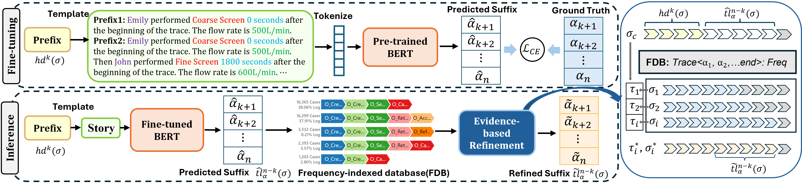
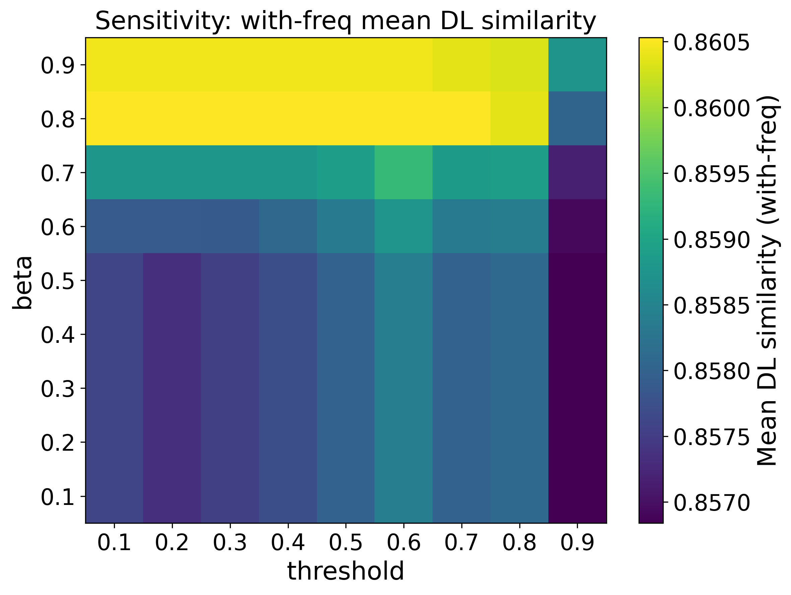

# EB-ReFine: Improving Suffix Prediction Accuracy for Long and Non-Pareto Event Logs through Evidence-Based Refinement

This repository provides the official PyTorch implementation of the paper [**EB-ReFine: Improving Suffix Prediction Accuracy for Long and Non-Pareto Event Logs through Evidence-Based Refinement**](TBA).

<div align="center">
    <a href="https://"></a>
</div>

# Details

> Predictive Process Monitoring (PPM) seeks to anticipate the future behavior of ongoing process instances, an area that has seen rapid progress with deep learning techniques. Yet, accurately predicting future activity sequences (suffix) remains difficult, particularly on long and Non-Pareto event logs. In long-tail suffix prediction, stepwise errors accumulate, significantly reducing sequence-level accuracy. This challenge is amplified in Non-Pareto logs, where activity frequencies are more evenly distributed and dominant behavioral patterns are absent, limiting statistical cues for generalization. To address these limitations, we propose EB-ReFine, a refinement framework that integrates deep learning with evidence-based refinement mechanism to improve suffix prediction, especially on long and Non-Pareto event logs. EB-ReFine employs a two-stage design: (1) fine-tune a BERT-based model to generate an initial suffix prediction; (2) this prediction is then refined by comparing it against frequency-indexed database(FDB) through the proposed evidence-based refinement mechanism. By combining learned predictions with historical evidence, EB-ReFine efficiently retrieves the most relevant historical trace to guide the final revision.  Crucially, the refinement operates solely at inference, introducing no additional training overhead while yielding substantial accuracy gains. Extensive experiments demonstrate that EB-ReFine consistently outperforms state-of-the-art baselines by 10\%–30\% across diverse public benchmark datasets. Additional evaluations on synthetic datasets simulating varying noise types in a wastewater treatment process further confirm its robustness to data imperfections.

## Datasets

We utilized six public event logs from various domains: BPI15_1, BPI17O, BPI20R, Helpdesk, MIP and SEPSIS. To assess noise resilience, we construct a synthetic dataset simulating wastewater treatment. 

## Environment Setup(python=3.9)
```bash
pip install torch==2.6.0 torchvision==0.21.0 torchaudio==2.6.0 --index-url https://download.pytorch.org/whl/cu124
pip install transformers
pip install -U scikit-learn scipy matplotlib
pip install pandas
pip install faiss-cpu
pip install jellyfish
```
## Data preparation
```bash
from preprocessing.log_to_history import Log
Log(csv_log, TYPE)
```
## Training
```bash
python train.py --csv_log helpdesk --type all --multi_gpu
```
## Models
You can directly download our trained models via this [link](https://drive.google.com/file/d/1KoJdWrB39rABbwTXUt0GtI_3DN37s02D/view?usp=sharing) and put it under `models/` for evaluation and testing.

## Evaluation
```bash
python evaluation.py --csv_log helpdesk --type all --beta 0.8 --threshold 0.4
```
## Test
In this [notebook](https://github.com/Lottie-641/EB-ReFine/blob/main/test.ipynb), you can input either:
- prefix as IDs: "12 5 9"
- prefix as activity names

## Hyperparameters Sensitivity (beta × threshold)
<div align="center">
    <a href="https://"></a>
</div>
On the Helpdesk dataset, the heatmap shows that performance is more sensitive to β than to the threshold θ: higher β (around 0.8–0.9) consistently yields better and more stable mean DL similarity. In contrast, θ has a relatively small effect within 0.1–0.8, while setting θ too high (0.9) noticeably degrades performance, likely due to overly conservative overriding. Therefore, we choose β = 0.8 and θ = 0.4 as the default configuration.

## Inference Time Comparison (No-Freq vs With-Freq) 
Run multiple iterations (2000 runs) and report: total time and avg time per run
- Notebook: test.ipynb

| Method    | Total time              | Avg time per run (s)           |
| --------- | -------------------- | --------------------------------- |
| BERT      | 6.410728s            |        0.003205s                  |
| EB-ReFine | 6.447285s            |        0.003224s                  |

## Citation


